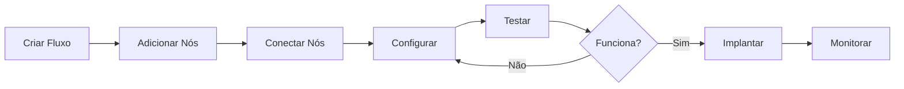

# 🤖 BotFlow - Editor de Fluxos para WhatsApp

Sistema completo de automação de WhatsApp com editor visual de fluxos, inspirado no Manychat.

## 🎯 Funcionalidades

### ✅ Editor de Fluxos Visual
- **13 tipos de nós diferentes** organizados em categorias
- **Drag & Drop** intuitivo para criar fluxos
- **Conexões visuais** entre nós
- **Painel de propriedades** para edição rápida
- **Configuração detalhada** via double-click

### 📦 Biblioteca de Fluxos
- **Visualização em cards** com preview
- **Busca e filtros** de fluxos
- **Templates pré-configurados**:
  - Fluxo de Boas-Vindas
  - Atendimento Automatizado
  - Pesquisa de Satisfação
  - Campanha Promocional
- **Duplicação e gestão** de fluxos

### 🔧 Tipos de Nós

#### Controle
- **Start**: Início do fluxo
- **End**: Finalização do fluxo

#### Mensagens
- **Message**: Envio de texto
- **Button**: Botões interativos (até 3)
- **List**: Lista de opções
- **Input**: Captura resposta do usuário

#### Mídia
- **Audio**: Envio de áudio
- **Image**: Envio de imagem
- **Video**: Envio de vídeo

#### Lógica
- **Condition**: Ramificação condicional
- **Delay**: Aguardar tempo
- **AI**: Resposta com Inteligência Artificial

#### Integrações
- **Action**: Executar ação (salvar, email, API)
- **Webhook**: Chamar API externa

## 🚀 Como Usar

### 1. Criar Novo Fluxo

#### Opção A: Do Zero
1. Acesse **"Fluxos"** no menu lateral
2. Clique em **"Novo Fluxo"**
3. Arraste nós da barra lateral para o canvas
4. Conecte os nós arrastando das bolinhas
5. Configure cada nó (clique simples ou duplo)
6. Salve o fluxo

#### Opção B: A partir de Template
1. Acesse **"Fluxos"** no menu lateral
2. Clique em **"Templates"**
3. Escolha um template
4. Personalize conforme necessário
5. Salve o fluxo

### 2. Editar Fluxos

#### Edição Rápida (Painel Lateral)
- Clique uma vez no nó
- Painel lateral abre com campos principais
- Edite e as mudanças são salvas automaticamente

#### Edição Completa (Dialog)
- Clique duas vezes no nó
- Dialog abre com todas as opções
- Configure e clique em "Salvar"

### 3. Gerenciar Fluxos

Na página **"Fluxos"** você pode:
- **Buscar** fluxos pelo nome
- **Ver estatísticas** gerais
- **Duplicar** fluxos
- **Deletar** fluxos
- **Editar** fluxos existentes

### 4. Configurar Nós

#### Nó de Mensagem
```
- Mensagem: Texto a enviar
- Variáveis: {{nome}}, {{telefone}}, {{email}}
- Delay: Tempo antes de enviar (segundos)
- Digitação: Simular digitação (segundos)
```

#### Nó de Botões
```
- Mensagem: Texto antes dos botões
- Botões: Até 3 botões
- Cada botão pode ter uma saída diferente
```

#### Nó de IA
```
- Modelo: GPT-4, GPT-3.5, Gemini, Claude
- Prompt: Instruções para a IA
- Criatividade: 0 (preciso) a 2 (criativo)
- Tamanho: Máximo de tokens
```

#### Nó de Condição
```
- Variável: Nome da variável a verificar
- Operador: Igual, Diferente, Contém, Maior, Menor
- Valor: Valor para comparação
- Duas saídas: Verdadeiro e Falso
```

## 🎨 Design System

### Cores Semânticas
```css
--primary: Verde (#1abc9c)
--success: Verde sucesso
--warning: Laranja aviso
--destructive: Vermelho erro
--info: Azul informação
```

### Cores por Tipo de Nó
- **Mensagem**: Azul (#3b82f6)
- **Botões**: Verde (#22c55e)
- **Lista**: Âmbar (#f59e0b)
- **Entrada**: Teal (#14b8a6)
- **Áudio**: Roxo (#a855f7)
- **Imagem**: Rosa (#ec4899)
- **Vídeo**: Laranja (#f97316)
- **Condição**: Amarelo (#eab308)
- **Delay**: Ciano (#06b6d4)
- **IA**: Fúcsia (#d946ef)
- **Ação**: Violeta (#8b5cf6)
- **Webhook**: Índigo (#6366f1)
- **Início**: Esmeralda (#10b981)
- **Fim**: Vermelho (#ef4444)

## 📱 Páginas do Sistema

### /flows
Biblioteca de fluxos com cards, busca, templates e estatísticas

### /flow-editor
Editor visual de fluxos com canvas, toolbox e painéis

### /dashboard
Dashboard principal com métricas gerais

### /bots
Configuração de bots e números de WhatsApp

### /messages
Gerenciamento de mensagens

### /analytics
Analytics e métricas detalhadas

### /automation
Automações gerais do sistema

## ⌨️ Atalhos

```
Arrastar nó: Click + Drag do toolbox
Conectar nós: Drag da bolinha de saída para entrada
Edição rápida: Click simples no nó
Edição completa: Double-click no nó
Deletar nó: Selecionar + botão Delete no painel
Salvar fluxo: Botão "Salvar" no toolbar
```

## 🔄 Fluxo de Trabalho



## 📊 Métricas Disponíveis

- **Execuções Totais**: Quantas vezes o fluxo rodou
- **Taxa de Conclusão**: % de fluxos que chegaram ao fim
- **Usuários Únicos**: Quantos usuários passaram pelo fluxo
- **Tempo Médio**: Tempo médio de execução
- **Funil de Conversão**: Performance por nó
- **Pontos de Saída**: Onde usuários saem do fluxo

## 🎓 Melhores Práticas

### 1. Nomeação
- Use nomes descritivos para os fluxos
- Adicione descrições claras
- Organize por categorias

### 2. Estrutura
- Sempre comece com um nó Start
- Sempre termine com um nó End
- Evite nós desconectados
- Teste todos os caminhos possíveis

### 3. Mensagens
- Seja claro e objetivo
- Use variáveis para personalização
- Adicione delays para parecer natural
- Simule digitação para UX melhor

### 4. Condições
- Valide todas as entradas do usuário
- Tenha sempre um caminho padrão
- Trate erros adequadamente

### 5. IA
- Seja específico no prompt
- Configure temperature adequadamente
- Limite o tamanho das respostas
- Sempre tenha um fallback

## 🐛 Troubleshooting

### Fluxo não salva
- Verifique se deu um nome ao fluxo
- Verifique conexão com internet
- Limpe o cache do navegador

### Nós não conectam
- Certifique-se de arrastar da saída para entrada
- Verifique se não há erros no console
- Recarregue a página

### Configuração não aplica
- Clique em "Salvar" no dialog
- Verifique se os campos obrigatórios estão preenchidos
- Tente editar novamente

## 🔮 Próximas Funcionalidades

- [ ] Backend com Supabase
- [ ] Autenticação de usuários
- [ ] Integração real com WhatsApp
- [ ] Analytics em tempo real
- [ ] Testes de fluxo
- [ ] Versionamento de fluxos
- [ ] Colaboração em equipe
- [ ] Marketplace de templates
- [ ] Exportar como imagem
- [ ] Atalhos de teclado avançados

## 📚 Recursos Adicionais

- **Documentação Completa**: Ver PROJECT_ANALYSIS.md
- **Roadmap**: Ver PROJECT_ANALYSIS.md
- **Contribuir**: Ver CONTRIBUTING.md (futuro)

## 🤝 Suporte

Para dúvidas e suporte, acesse o menu **"Manual"** no sistema.

---

Desenvolvido com ❤️ usando React, TypeScript, Tailwind CSS e Supabase
